<p align="center">
  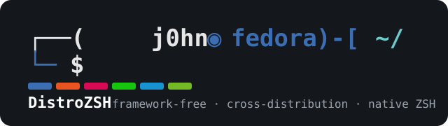
</p>

<h1 align="center">DistroZSH</h1>

<p align="center">
  <em>A lightweight, framework-free, cross-distribution ZSH experience inspired by native Linux distributions.</em>
</p>

<p align="center">
  The ZSH prompt every Linux distribution <strong>should</strong> have shipped.
</p>

<p align="center">
  <a href="#supported-distributions">Distributions</a> ·
  <a href="#features">Features</a> ·
  <a href="#quick-start">Quick Start</a> ·
  <a href="#configuration">Configuration</a> ·
  <a href="#layouts">Layouts</a> ·
  <a href="docs/FAQ.md">FAQ</a> ·
  <a href="LICENSE">License</a>
</p>

<p align="center">
  <a href="https://github.com/johnvexcoder/DistroZSH/actions/workflows/ci.yml"></a>
  
  
  
  
  
</p>

---

## Preview

<div align="center">

| | |
|:---:|:---:|
| **Fedora** <br/> 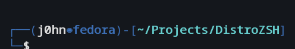 | **Ubuntu** <br/> 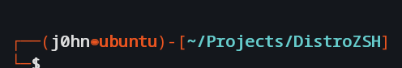 |
| **Kali Linux** <br/> 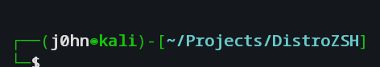 | **Arch Linux** <br/> 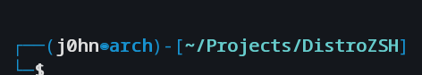 |
| **Debian** <br/> 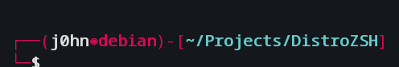 | **openSUSE** <br/> 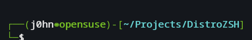 |
| **Rocky Linux** <br/> 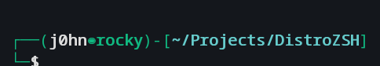 | **AlmaLinux** <br/> 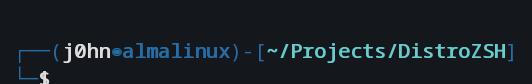 |

</div>

The prompt automatically adopts the color of your distribution while keeping one consistent layout. The **◉** separator is DistroZSH's identity — it is *not* Kali's `㉿`.

> All screenshots are generated from the real prompt engine by `scripts/preview.sh`.

---

## Supported Distributions

### Official Support

<div align="center">

| | | | | |
|:---:|:---:|:---:|:---:|:---:|
|  |  |  | 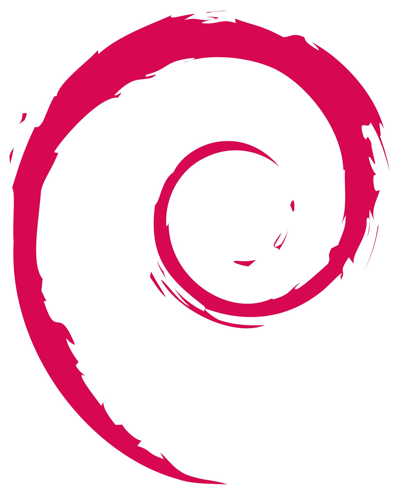 | 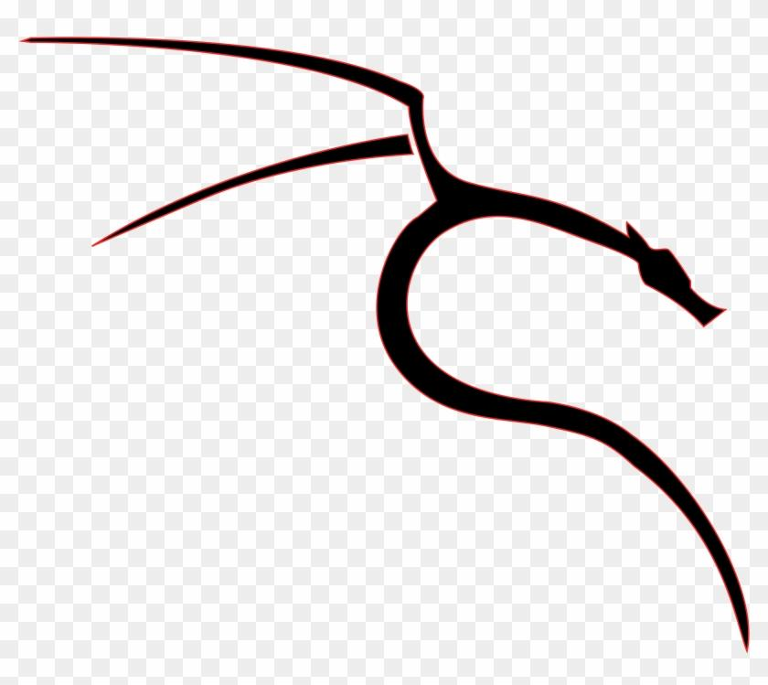 |
| **Fedora** | **Ubuntu** | **Linux Mint** | **Debian** | **Kali Linux** |
| Supported | Supported | Supported | Supported | Supported |
| 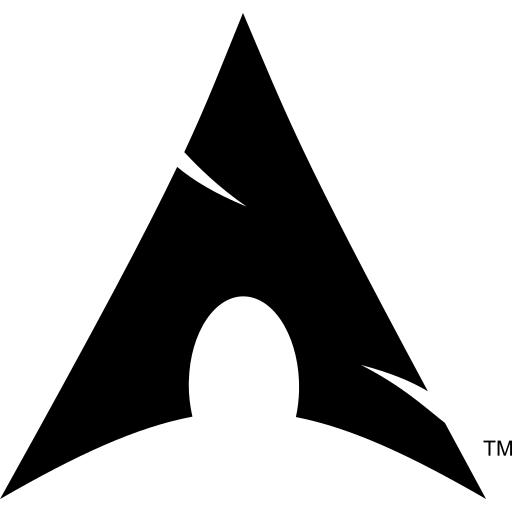 |  |  | 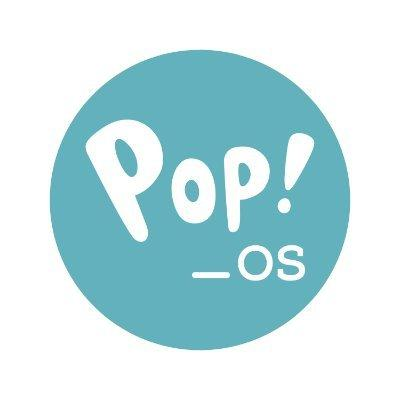 |  |
| **Arch Linux** | **Manjaro** | **openSUSE** | **Pop!_OS** | **elementary OS** |
| Supported | Supported | Supported | Supported | Supported |
|  | 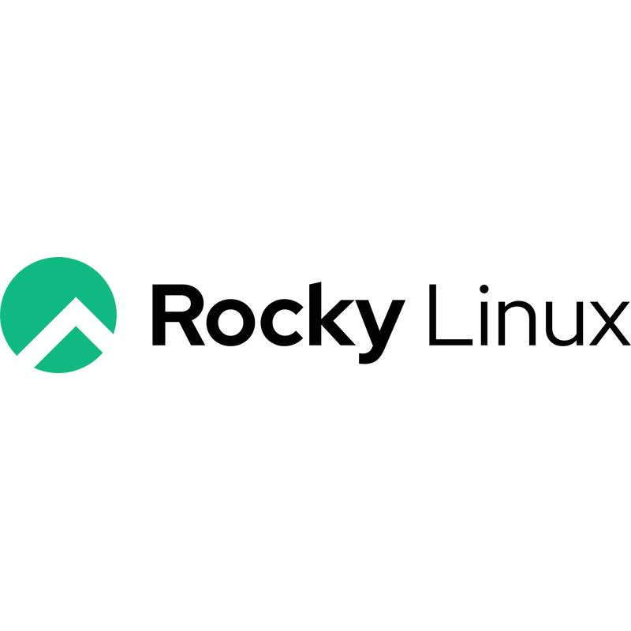 |  | | |
| **Zorin OS** | **Rocky Linux** | **AlmaLinux** | | |
| Supported | Supported | Supported | | |

</div>

### Community Support

<div align="center">

| | | | | |
|:---:|:---:|:---:|:---:|:---:|
| 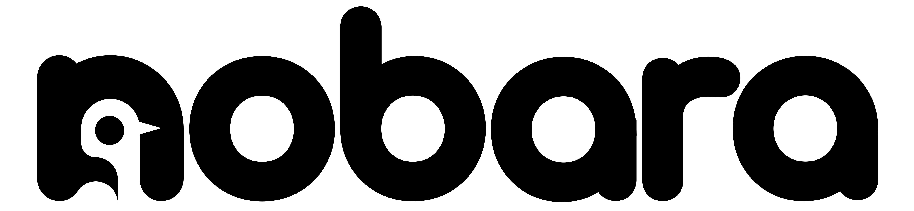 |  |  | 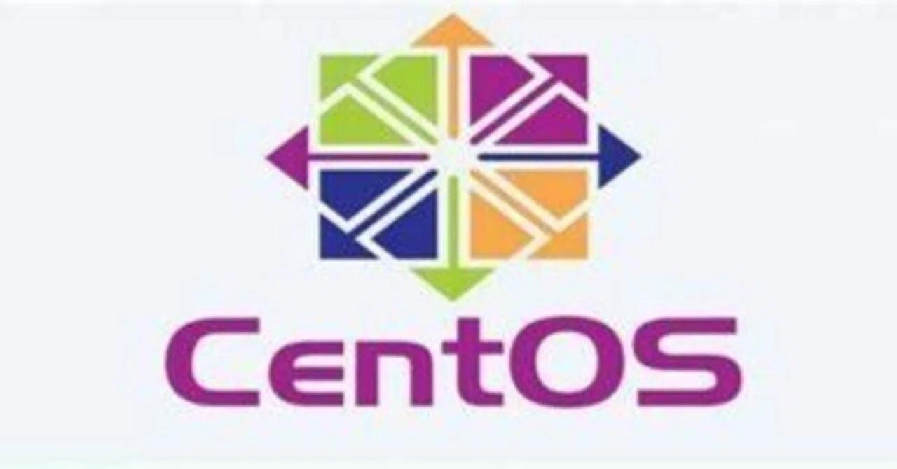 |  |
| **Nobara** | **Ultramarine** | **Bazzite** | **CentOS Stream** | **Oracle Linux** |
| Supported | Supported | Supported | Supported | Supported |
|  | 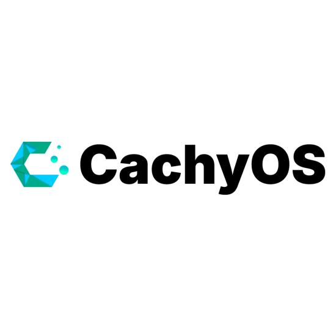 |  | 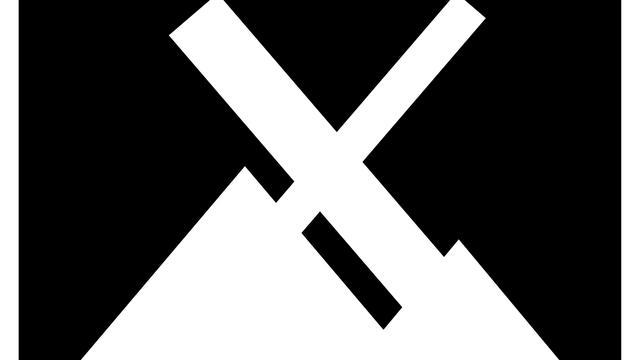 |  |
| **Garuda Linux** | **CachyOS** | **Artix Linux** | **MX Linux** | **Parrot OS** |
| Supported | Supported | Supported | Supported | Supported |
|  |  |  | | |
| **KDE neon** | **Vanilla OS** | **Peppermint OS** | | |
| Supported | Supported | Supported | | |

</div>

Unknown distributions automatically fall back to the neutral `generic` theme, and derivatives inherit the closest registered parent theme.

---

## Why DistroZSH?

DistroZSH is not another Oh My Zsh. There is no framework, no plugin manager, no external prompt engine, and no Nerd Font requirement. Everything is implemented in **native ZSH**, and the only plugins loaded are the standalone plugins that Linux distributions already package.

| Feature | DistroZSH | Oh My Zsh | Starship | Powerlevel10k | Prezto | Zinit |
| --- | :-: | :-: | :-: | :-: | :-: | :-: |
| Framework-free | ✅ | ❌ | ❌ | ❌ | ❌ | ❌ |
| Native ZSH prompt engine | ✅ | ✅ | ❌ | ❌ | ✅ | ❌ |
| Auto theme per distribution | ✅ | ❌ | ❌ | ❌ | ❌ | ❌ |
| Uses distribution plugin packages | ✅ | ❌ | ❌ | ❌ | ❌ | ❌ |
| No Nerd Font requirement | ✅ | ✅ | ❌ | ❌ | ✅ | ✅ |
| Installs via native package manager | ✅ | ❌ | ❌ | ❌ | ❌ | ❌ |
| Fully reversible installer | ✅ | ❌ | ❌ | ❌ | ❌ | ❌ |
| Built-in command-not-found | ✅ | ❌ | ❌ | ❌ | ❌ | ❌ |
| Startup time | **ms** | slow | slow | fast | slow | slow |

---

## Features

- **Automatic distribution detection** — reads `/etc/os-release` (`ID`, `ID_LIKE`, `NAME`, `PRETTY_NAME`) at load time
- **Per-distribution color themes** — Fedora blue, Ubuntu orange, Debian red, Kali green, Arch blue, openSUSE green, and 15 more
- **Four prompt layouts** — `kali` (default two-line box), `oneline`, `minimal`, `compact`
- **User configuration without touching code** — everything in `~/.config/distrozsh/config.zsh`
- **Custom themes** — drop a file in `~/.config/distrozsh/themes/` and you're done
- **Excellent completion** — case-insensitive, colored, menu selection, cached
- **Smart history** — deduplication, ignore-space, verification, full-history alias
- **Good key bindings** — Emacs mode, word jumps, `Ctrl+P` to cycle layouts
- **Smart command-not-found** — built-in fallback with "did you mean?" typo suggestions (Levenshtein distance + adjacent-transposition detection) and distribution package-manager install hints
- **Interactive typo correction** — optional ZSH spell correction (`CORRECT`), on by default, so `~` becomes `~/`, `git sut` becomes `git stash`, and more
- **Fast startup** — no subprocesses in the prompt, everything built at load time
- **Works with any standard monospace font** — Noto Sans Mono, JetBrains Mono, DejaVu Sans Mono, Fira Code

### Not included (by design)

No battery indicator, no clocks, no CPU/RAM graphs, no Docker/Kubernetes widgets, no Powerline, no Nerd Fonts.

---

## Quick Start

### Prerequisites

- `zsh` 5.9+
- One of: `dnf`, `apt`, `pacman`, or `zypper`

### Installation

```sh
git clone https://github.com/johnvexcoder/DistroZSH.git
cd DistroZSH
./install.sh
```

The installer will:

1. Detect your distribution and package manager.
2. Install `zsh`, `zsh-autosuggestions` and `zsh-syntax-highlighting` from your native repositories.
3. Back up any existing `~/.zshrc`.
4. Install the engine to `~/.config/distrozsh/`.
5. Ask whether to make `zsh` your default shell.

```sh
./install.sh --shell      # install and change the default shell (no prompt)
./install.sh --no-shell   # install without changing the default shell
./install.sh --help       # full help
```

Start a new terminal (or run `exec zsh`) when the installer finishes.

> Full guide with per-distribution notes: [docs/INSTALLATION.md](docs/INSTALLATION.md)

---

## Configuration

Everything user-facing lives in `~/.config/distrozsh/config.zsh`:

```zsh
DISTROZSH_THEME=auto        # auto, fedora, ubuntu, kali, arch, ... generic, or custom
DISTROZSH_LAYOUT=kali       # kali, oneline, minimal, compact
DISTROZSH_NEWLINE_BEFORE_PROMPT=no
DISTROZSH_SET_TITLE=yes
```

| Setting | Default | Description |
| --- | --- | --- |
| `DISTROZSH_THEME` | `auto` | `auto` detects from the running distribution; any theme name forces it |
| `DISTROZSH_LAYOUT` | `kali` | `kali`, `oneline`, `minimal`, `compact` |
| `DISTROZSH_NEWLINE_BEFORE_PROMPT` | `no` | print a blank line before each prompt |
| `DISTROZSH_SET_TITLE` | `yes` | set the terminal window title to `user@host: dir` |
| `DISTROZSH_HISTFILE` | `~/.zsh_history` | history database location |
| `DISTROZSH_COMMAND_NOT_FOUND` | `auto` | `auto`, `distro`, `builtin`, or `off` — how unknown commands are handled |
| `DISTROZSH_COMMAND_CORRECTION` | `yes` | `yes`/`no` — enable ZSH's interactive spell correction |

See [docs/THEMES.md](docs/THEMES.md) and [docs/LAYOUTS.md](docs/LAYOUTS.md) for the full catalog.

---

## Layouts

<div align="center">

| Layout | Prompt Style |
|:---:|:---|
| **kali** (default) | `┌──(user◉distro)-[~/path]` <br/> `└─$` |
| **oneline** | `user◉distro:~/path$` |
| **compact** | `user@host:~/path$` |
| **minimal** | `~/path$` |

</div>

Cycle between layouts at any time with **Ctrl+P**.

---

## Uninstallation

```sh
./uninstall.sh
```

Restores your previous `~/.zshrc`, restores your previous default shell, saves your `config.zsh`, and removes the engine. It **never** uninstalls `zsh` or the plugins.

---

## Customization

### Create your own theme

```sh
cp themes/_template.zsh ~/.config/distrozsh/themes/mine.zsh
# edit the seven colors, then:
echo 'DISTROZSH_THEME=mine' >> ~/.config/distrozsh/config.zsh
```

Themes only define colors — never structure. See `themes/_template.zsh`.

### Create your own layout

Copy a file from `layouts/` into `~/.config/distrozsh/layouts/` and define the `_distrozsh_prompt` function.

---

## Project Layout

```
DistroZSH/
├── .zshrc              # thin launcher (do not edit)
├── init.zsh            # engine bootstrap
├── config.zsh          # user configuration template
├── install.sh          # installer (dnf / apt / pacman / zypper)
├── uninstall.sh        # uninstaller (fully reversible)
├── zsh/                # engine modules (one concern per file)
├── themes/             # per-distribution color palettes
├── layouts/            # prompt structure definitions
├── scripts/            # distro-detect.sh, preview.sh, screenshot tooling
├── tests/              # test suite (tests/run.sh) + os-release fixtures
├── screenshots/        # generated preview matrix (PNG + ANSI)
├── img/                # distribution logos (official + community)
├── docs/               # installation, themes, layouts, FAQ
├── Makefile            # make check / lint / test / preview / install
└── .github/            # workflows, issue + PR templates
```

---

## Roadmap

See [ROADMAP.md](ROADMAP.md).

## Contributing

Contributions are welcome. Please read [CONTRIBUTING.md](CONTRIBUTING.md) and our [Code of Conduct](CODE_OF_CONDUCT.md).

## Security

Found a problem? See [SECURITY.md](SECURITY.md).

## License

[MIT](LICENSE) © 2026 J0hn Vex Coder

---

## Author

**J0hn Vex Coder**
[github.com/johnvexcoder](https://github.com/johnvexcoder)
